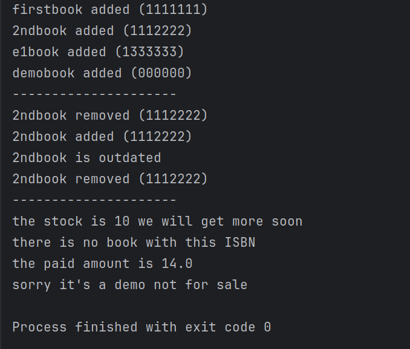

# Quantum Bookstore – Fawry N² Dev Slope Challenge #10

A console-based inventory and purchase system for an online bookstore.

## Features

- PaperBook: Has stock and is physically shipped
- EBook: Has a file type and is sent via email
- ShowcaseBook: Demo copy, not for sale
- Inventory management system
- Buy book by ISBN, quantity, and customer info
- Remove outdated books (based on age)
- Includes test cases to validate functionality

## Tech Stack

- Language: Java
- Architecture: OOP-based 

## Core Concepts Used

- Main class `Book` can set as `Demo`
- Subclasses: `PaperBook`, `EBook`
- `Inventory` class for managing books
- `ShippingService` and `MailService` services

## Book Structure

Each book has:
- `ISBN` – unique string identifier
- `title`
- `yearOfPublished`
- `price`
- `isDemo`

Specific types add:
- `PaperBook`: `quantity`,`shippable`
- `EBook`: `fileType` , `canSend`
- `Demo`:  not for sale

## Sceenshots
